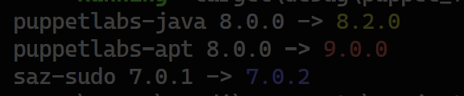

# puppet_forge_updates

A small CLI helper to check for updates of your Puppet modules.
It reads your Puppetfile, compares the specified module versions with the latest available on the Puppet Forge, and shows which modules have updates available.
Update severity is color-coded:
- **Red**: Major update
- **Yellow**: Minor update
- **Blue**: Patch update

## Features

- Parses Puppetfile and detects module versions
- Fetches latest versions from Puppet Forge
- Color-coded output for update severity
- Simple CLI usage

## Example Output



## Installation

### Using Cargo

```bash
git clone https://github.com/urtokk/puppet_forge_updates.git
cd puppet_forge_updates
cargo install --path .
```

## Usage

```bash
puppet_forge_updates /path/to/Puppetfile
```

## Requirements

- Rust (edition 2021 or newer)
- Internet connection (for live version checks)

## Development

- Clone the repository
- Run tests with `cargo test`
- Build with `cargo build`

## Contributing

Pull requests and issues are welcome!
Please open an issue for bugs or feature requests.

## License

This project is licensed under the MIT License - see the [LICENSE](LICENSE) file for details.
